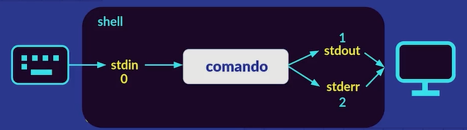

# Bash

## Que es la teminal?

- La terminal es una interfaz grafica muy sencilla que simula una linea de comandos (shell)
  + Terminal: Ventana que muestra el promt
  + Shell (linea de comandos): Programa que ejecuta los comandos. Hay varios tipos de shell algunos son:
    * Bourne shell
    * Bash Shell $\longrightarrow$ mas comun
    * Z Shell $\longrightarrow$ mas comun
    * C shell
    * Korn Shell
    * Fish Shell
    * Power Shell

- Las razones para aprender a usarla son:
  + Tenemos mucha flexibilidad ya que podemos hacer procesos dentro de nuestra computadora de una forma mas eficiente puede mover grandes volumenes de datos de forma rapida y asi como hacer copias e incluso programar procesos que se ejecuten en cierto tiempo.
  + Normalmente hacer cosas en la terminal como copiar archivos o buscarlos tiende a ser mucho mas rapido que hacerlo a traves de una interfaz grafica Por lo tanto podemos decir que tenemos una velocidad mayor al realizar dichos procesos en la terminal
  + **No siempre contaremos con una interfaz grafica** o puede llegar a fallar
- Un comando (de manera sencilla) es un programa que se puede ejecutar desde la terminal este puede recibir parametros y opciones

## Que es un comando?

- Estos pueden ser 4 cosas distintas:
    + Un programa ejecutable
    + Una utilidad de la Shell
    + Una funcion de la Shell
    + Un alias

- Para poder conocer mejor los comandos, existen unos comandos que nos ayudan a comprender el resto:
    + **type** (Muestra que tipo de comando es)
    + **help** (Muestra todo lo que se puede hacer con el comando)
    + **Whatis** (Ofrece una descripcion corta del comando)

### Anatomia de un comando

- Un comando esta dado por una anatomia determinada como el cuerpo humano:

````bash
$rm -rf directory
````
- Las partes son:
    + *$* representa el promp
    + *rm* representa el comando a utilizar
    + *-rf* representan las opciones del comando (ver opciones con **help**)
    + *directory* representa el argumento o elemento sobre el cual se va a ejecutar el comando

## Comandos Basicos

### Navegacion en el sistema de archivos

  + **cd + directorio** (abre el directorio)
  + **cd ..** (sirve para devolverse un directorio/carpeta)
    * **cd ../..** (para 2 directorios)
    * **cd ../../..** (para 3 directorios)
  + **pwd** (imprime/muestra en qué directorio/archivo estamos)
  + **cd + pwd** (muestra el directorio principal)

### Limpieza o salida de Terminal

  + **clear**( para limpiar la terminal)
  + **exit** (sirve para salir de la terminal)
  + **reset** (resetea la terminal cuando está lenta)

### Creacion de archivos y directorios

  + **mkdir** (sirve para crear un nuevo directorio)
  + **mkdir "nombre1" "nombre2"** (sirve para crear varios directorios a la vez)
  + **touch** (sirve para crear archivos)

### Copia de archivos

  + **cp** (copia archivos y directorios)

### Visualizacion de archivos en Terminal

  + **cat "nombre del archivo"** (muestra el contenido de un archivo en la terminal)
  + **less** (abre el archivo de forma interactiva en la terminal)
  + **head "archivo"** (muestra las primeras líneas de un archivo)
  + **head "archivo" -n "numero deseado"** e(sto muestra la cantidad de líneas que deseas visualizar del inicio)
  + **tail "archivo"** (muestra las últimas líneas de un archivo)
  + **tail "archivo" -n "numero deseado"** (esto muestra la cantidad de líneas que deseas visualizar del final)

### Busqueda en archivos en Terminal

  + **grep "palabra"** (busca texto en archivos)
  + **which "archivo/directorio"** (Este comando sirve para buscar la ubicación de ejecutables en el PATH del sistema.)
  + **whereis** (Similar a `which`, pero busca más extensivamente en localizaciones estándar, mostrando también manuales y archivos fuente si están disponibles.)
  + **find "ruta" -name "nombre del archivo"**( Permite buscar en todos los directorios el archivo especificado desde la ruta dada.)
  + **find "ruta" -type f -name \*.log**
  + **find "ruta" -size "valor y unidad de medida"**
  + Se pueden usar wildcards y el pipe operator para filtrar y gestionar los resultados (**Se veran mas adelante**)

#### Usando el comando grep

##### ¿Qué hace grep?
- `grep` nos permite encontrar coincidencias de texto en archivos utilizando cadenas de texto o expresiones regulares.

````bash
$grep "palabra a encontrar" "archivo" 
$grep "Expresión Regular" "archivo"
````

##### ¿Qué hace el parámetro -i en grep?
- El parámetro `-i` hace que la búsqueda sea insensible a mayúsculas y minúsculas.

````bash
$grep -i "palabra" "archivo"
````

##### ¿Qué hace el parámetro -v?
- El parámetro `-v` devuelve las líneas que no contienen la coincidencia.

````bash
$grep -v "palabra" "archivo"
````

##### ¿Qué hace -c?
- El parámetro `-c` cuenta el número de líneas que contienen la coincidencia.

````bash
$grep -c "palabra" "archivo"
````

##### ¿Qué hace -m?
- El parámetro `-m` limita el número de coincidencias devueltas a un número específico de líneas.

````bash
$grep -m 5 "palabra" "archivo"
````

#### Usando el comando wc

##### ¿Qué hace wc?
- `wc` es un comando que cuenta la cantidad de palabras, líneas y bytes en un archivo.
  + **Parámetros de wc**:
    * `-l`: cuenta el número de líneas.
    * `-w`: cuenta el número de palabras.
    * `-c`: cuenta el número de bytes.

##### Combinar opciones de grep
- Puedes combinar varias opciones de `grep` para realizar búsquedas más específicas.
````bash
$grep -iv "palabra" "archivo"
$grep -ci "palabra" "archivo"
$grep -vi "palabra" "archivo"
$grep -vm 5 "palabra" "archivo"
````
* busca ignorando mayúsculas y muestra líneas sin la coincidencia.
* cuenta las líneas que contienen la coincidencia, ignorando mayúsculas.
* muestra líneas sin la coincidencia, ignorando mayúsculas.
* muestra hasta 5 líneas que no contienen la coincidencia.

### Procesos del computador

#### Visualización de Procesos
- **ps** (Este comando se usa para ver los procesos activos en la terminal.)
  + **ps aux** (Muestra todos los procesos en ejecución con detalles completos.)
  + **ps -e** (Muestra todos los procesos del sistema.)
  + **ps -u usuario**: (Muestra los procesos de un usuario específico.)

- **top** (Este comando proporciona una vista dinámica en tiempo real de los procesos en ejecución del sistema. )
    + Es útil para monitorizar la carga del sistema y los recursos utilizados por los procesos:
        + Dentro de `top`, puedes usar teclas como `k` para matar procesos, `u` para filtrar por usuario, y `P` para ordenar por uso de CPU.

- **jobs** (Este comando proporciona una vista dinámica en tiempo real de los procesos en ejecución del sistema en backgound.)
- **htop** ((si está instalado) Una versión mejorada de `top` con una interfaz más amigable y opciones adicionales para gestionar procesos de forma interactiva.)

#### Gestión de Procesos
- **kill** (Este comando se utiliza para enviar señales a procesos. La más común es la señal de terminación (`SIGTERM`) para pedir a un proceso que se detenga de manera segura. Si eso falla, se puede usar `SIGKILL` para forzar el cierre)

````bash
$kill 1234
$kill -9 1234
$kill -l
````
- Envía la señal `SIGTERM` al proceso con PID 1234.
- Envía la señal `SIGKILL` al proceso con PID 1234, forzando su terminación.
- Lista todas las señales que se pueden enviar con `kill`.

### Conexiones Seguras

  + **ssh** (inicia una sesión segura de shell remota en otro sistema)

### Utilidades de red

  + **ping** (es un comando utilizado para probar la conectividad entre tu sistema y otro host o dirección IP en la red.)
    - Opciones útiles:
        * `-c` limita la cantidad de paquetes enviados.
        * `-s` especifica el tamaño de los paquetes.
  + **ifconfig y netstat** (son comandos que permiten visualizar y controlar la configuración de red del sistema, incluyendo máscaras de red, puertos de transmisión y configuración de tarjetas de red.)
  + **curl** (es una herramienta de línea de comandos para transferir datos con URLs. Permite traer el HTML de una página web, que puede ser guardado utilizando redirección de salida estándar.)
  + **wget** (es una herramienta para descargar contenido desde la web. Es similar a `curl`, pero se especializa en descargar archivos.)
  + **traceroute** (muestra la ruta que toman los paquetes desde el host local hasta el host de destino especificado. Proporciona una lista de los enrutadores que los paquetes atraviesan, lo cual es útil para diagnosticar problemas de red.)
  + **netstat** (es una herramienta poderosa para monitorear conexiones de red, estadísticas de red y la tabla de enrutamiento.)
    - `-i` muestra la lista de todas las interfaces de red.

### VsCode

  + **code . + archivo** (sirve para poderlo abrir en VsCode)
  + **code .** (abre VsCode en el directorio que esta la terminal)
  + **code-insiders .** (abre VsCode-inisders en el directorio que esta la terminal)

### Movimiento o renombramiento de archivos

  + **mv** (para mover un archivo)
  + **mv "nombre archivo" ..** (sirve para mover el archivo a su directorio anterior)
  + **mv "nombre viejo" "nombre nuevo"** (sirve para renombrar archivos o directorios)

### Apertura de aplicaciones

  + **xdg-open "lo que se desea abrir"** (sirve para abrir apps del pc)
  + **nemo "carpeta deseada"** (sirve para abrir el archivo o carpeta dentro del file manager)

### Informacion de Comandos

  + **type "comando"** (nos permite conocer qué tipo de comando es)
  + **alias "nombre que se desea"="secuencia de comandos"** (nos permite crear comandos que son temporales yse borran al cerrar la terminal)
  + **help "comando"** (nos permite consultar un poco de documentación de un comando)
  + **man "comando"** (de manual, nos permite conocer mucha más información de un comando)
  + **info "comando"** (similar al anterior, pero un poco resumido y con otro formato)
  + **whatis "comando"**( describe un comando en una sola línea)

### Listado de archivos y/o directorios

  + **tree** (sirve para ver todos los archivos en forma de árbol)
    * Para instalar tree seguir los siguientes pasos
      - verificamos si lo tenemos con el comando
        + **tree --version**
      - Para instalarlo con el siguiente comando
        + **sudo apt-get install tree**
      - Para tener la última versión
        + **sudo apt-get update**
      - Verificar que ya lo tengamos instalado
        + **tree --version**
  + **tree -L "nivel de archivos que se necesita"** s(irve para ver los archivos de nivel 1, 2, 3, etc.)
  + **ls** (muestra los archivos que tengamos o lo que contengan)
  + **ls -a** (todos los archivos, incluso los que comienzan con punto (.) son los archivos ocultos)
  + **ls -A** (lista todos los ficheros en los directorios, excepto los que comienzan con punto (.) y los que comienzan con doble punto (..))
  + **ls -F** (indica tipo / directorio, * ejecutable, @ enlace simbólico)
  + **ls -h** (indicará el tamaño en KB, MB, etc.)
  + **ls -l** (listado en formato largo (o detallado))
  + **ls -S** (clasifica los contenidos de los directorios por tamaños, con los ficheros más grandes en primer lugar)
  + **ls -r** (invierte el orden de la salida)
  + **ls -R** (lista recursivamente los subdirectorios encontrados)
  + **ls -t** (ordenar por fecha de última modificación)
  + **ls -u** (ordenar por fecha de último acceso)
  + **ls -x** (presenta los ficheros por columnas)
  + **ls -i** (precede la salida con el número de i-node)
  + **ls -lt** (muestra los archivos del más actual al más antiguo)
  + **ls -ltr** (muestra los archivos del más antiguo al más actual)
  + **ls -lhS**( muestra de forma ordenada los archivos por su tamaño)
  + **ls -la** (muestra los atributos de los archivos y los archivos ocultos)
  + **ls -lr** (muestra los directorios de abajo hacia arriba)
  + **ls -lh** (listar archivos para ver su peso de una manera más legible)
  + **ls -l** (muestra los archivos o lo que contengan en fila)
  + **ls -d** (para buscar carpeta/directorios)
  + **ls -altrFh** (comando que lista hide items, long data from items, time of modification, reverse time, show directories, show the weight of the item)
  + **ln -s** (sirve para crear un link simbólico)

### Eliminacion de archivos o directorios permanentemente

  + **rm** (sirve para eliminar un archivo/directorio)
  + **rm -r** (sirve para eliminar)
  + **rmdir o rm -d** (borra un directorio)
  + **rm -i** (sirve para borrar recursivamente)
  + **rm -rf** (obliga al archivo a borrarse (**Ojo te puedes cargar tu sistema operativo con este comando si no escribes bien el comando**))
  + **rm -ri** (sirve para borrar lo que está en un directorio y el directorio)

### Salida de comandos

  + **Ctrl + c** (sirve para matar cualquier programa)
  + **q** (para hacerle quit a las ejecuciones de consola)

### Comprimiendo y Descomprimiendo Archivos TAR y ZIP

#### Comprimiendo archivos TAR
- **tar -c** (seguido del nombre del archivo `.tar` crea un nuevo archivo tar.)
- **tar -cf "nombre archivo".tar** (indica que se está comprimiendo un archivo y se especifica el nombre.)
- **tar -cvf "nombre archivo".tar** (muestra en detalle (verbose) lo que se está comprimiendo.)
- **tar -cvf "nombre".tar "archivos"** (combina las opciones de compresión, verbosidad y archivo.)
- **tar -czvf "nombre archivo".tar.gz** (comprime y utiliza gzip para manejar archivos más grandes.)
- **tar -czvf "nombre".tar.gz "archivos"** (detalla la operación de compresión con gzip, verbosidad y archivo especificado.)

#### Descomprimiendo archivos TAR
- **tar -x "nombre archivo".tar** (descomprime un archivo tar.)
- **tar -xf "nombre archivo".tar** (indica que se está descomprimiendo un archivo y se especifica el nombre.)
- **tar -xvf "nombre archivo".tar** (muestra en detalle (verbose) lo que se está descomprimiendo.)
- **tar -xvf "nombre".tar "archivos"** (combina las opciones de descompresión, verbosidad y archivo.)
- **tar -xzvf "nombre archivo".tar.gz** (descomprime y maneja archivos comprimidos con gzip.)
- **tar -xzvf "nombre".tar.gz "archivos"** (detalla la operación de descompresión con gzip, verbosidad y archivo especificado.)

#### Comprimiendo archivos ZIP
- **zip "nombre archivo".zip** (comprime archivos individuales en un archivo zip.)
- **zip -r "nombre archivo".zip "carpeta"** (comprime una carpeta completa, incluyendo subcarpetas y archivos.)

#### Descomprimiendo archivos ZIP
- **unzip "nombre archivo".zip** (descomprime un archivo zip.)

### Adicionales

  + **cal** (es un calendario)
  + **cowsay -f dragon-and-cow "palabra" | lolcat**

## Wildcards

- Las wildcards o comodines son una serie de caracteres especiales que nos permiten encontrar patrones o realizar búsquedas más avanzadas. Es aplicable para archivos y directorios.
- Las wildcards te sirven para realizar seccionamiento de archivos o directorios, además de `ls` los wildcards también pueden usarse con cualquier comando que realice la manipulación de archivos como `mv`, `cp`, y `rm`.
- Comandos:
  + **ls \*"tipo de archivo que se desea buscar"** (muestra los tipos de archivos seleccionados.)
````bash
$ls *.txt
````
  + **ls "nombre del archivo"\*** (muestra los archivos con ese nombre.)
````bash
$ls TI*
````
  + **ls "nombre del archivo"?** (esto sirve para buscar todo lo que comience por la cadena de caracteres "nombre del archivo".)
  + **ls "nombre archivo"?** (sirve para buscar con 2 caracteres y así sucesivamente.)
  + **ls "nombre archivo"?\*** (puedes combinar wildcards.)
  + **ls [[:"característica específica":]]*** (esto sirve para buscar un archivo con características específicas.)
````bash
$ls [[:upper:]]*
````
este comando busca únicamente lo que inicie con mayúscula.
  + **ls ["caracter específico"]\***. (sirve para revisar que archivos inician por los caracteres)
````bash
$ls [ad]*
````
esto muestra los archivos que inician con las letras a y d.

## Sistema de redirecciones

### Entradas y salidas de la shell

- En la consola nosotros generamos una entrada cuando escribimos y una salida casi siempre que ejecutamos un comando
- A las entradas típicamente se les suele llamar **Standard Input** y a las salidas **Standard Output**, además se les suele abreviar como stdin y stdout
### File descriptors

- Los file descriptors son numeros que identifican un recurso. Funciona asociando un número con una acción, archivo o programa, en el caso de la shell tenemos 3 file descriptors:



#### Redirigir el Standard Output

- **> + "nombre archivo.extension"** (sirve para enviar el stdout al archivo determinado.)
- **>> + "nombre archivo.extension"** (sirve para concatenar (pegar dos cosas) las salidas de un comando a un archivo ya existente.)
- **2> + "nombre archivo.extension"** (sirve para enviar el stderr al archivo determinado, se usa su file descriptor)
- **> + "nombre archivo.extension" 2>&1** (sirve para redirigir tanto el stdout como el stderr)

Ejemplos:
```` bash
$ls -l > output.txt
$ls -l ./Certificados >> output.txt
$ls -lñ 2> error.txt
$ls -l > output.txt 2>&1
````

#### Redirigir el Standard Input

- **command + < "nombre archivo.extension"** (sirve para redigir el stdin a un archivo determinado)

### Pipe Operator

- El Pipe operator es un operador que permite tomar la salida de un comando y pasarla como entrada a otro comando.
- El Pipe operator es esto `|` y se usa así:
  + **"comando" | "comando"** y así sucesivamente hasta que sea necesario.

## Concatenacion de comandos

- Los operadores de control son símbolos reservados por la terminal que nos permiten encadenar comandos.
- Si usas constantemente la tecla enter para ejecutar varios comandos, puedes evitarlo usando el operador `;` que separa los comandos que estamos ejecutando.
- Comando para ejecutar comandos sincrónicamente, es decir, uno detrás de otro:
  + El comando es `;`.
````bash
$ls; mkdir Chamba; cal
````
- Comando para ejecutar asincrónicamente, es decir, se ejecutan al mismo tiempo:
  + El comando es `&`.
````bash
$ls & date & cal
````
- Comando de manera condicional **and**, es decir, ambos deben ser verdad:
  + El comando es `&&`.
````bash
$mkdir test && cd test
````
- Comando de manera condicional **or**, es decir, uno debe ser verdad:
  + El comando es `||`.
````bash
$cd kgqwd || touch archivo.txt
````
- Puedes combinar estos operadores de control para crear flujos de trabajo más complejos en la terminal.

## Sistema de permisos

### Tipos de archivos

  + "-" es un archivo normal
  + "d" es un directorio
  + "l" es un link simbolico
  + "b" es un bloque de archivo especial
  
### Tipos de modo
  + `dueño`: rwx, se representa en binario como: 111, se representa de modo octal como: 7
  + `grupo`: r-x, se representa en binario como: 101, se representa de modo octal como: 5
  + `world`: r-x, se representa en binario como: 101, se representa de modo octal como: 5

| Octal | Binario | Permiso |
|-------|---------|---------|
| 0     | 000     | ---     |
| 1     | 001     | --x     |
| 2     | 010     | -w-     |
| 3     | 011     | -wx     |
| 4     | 100     | r--     |
| 5     | 101     | r-x     |
| 6     | 110     | rw-     |
| 7     | 111     | rwx     |

#### Modo simbolico:

| Simbolo | Significado |
|---------|-------------|
|    u    |   usuario   |
|    g    |   grupo     |
|    o    |   world     |
|    a    |   todos     |

### Modificando permisos en la terminal
- Para cambiar los permisos de un archivo se usa el comando `chmod`:
  + **chmod "permiso del usuario" "permiso del grupo" "permiso del world" "archivo"**
````bash
$chmod 755 mitexto.txt
````
  + **chmod "símbolo"-"permiso" "archivo"**  (con este comando se puede quitar permisos.)
````bash
$chmod u-r mitexto.txt
````
  + **chmod "símbolo"+"permiso" "archivo"** (con este comando se puede otorgar permisos.)
````bash
$chmod u+r mitexto.txt
````
- Para gestionar usuarios se usa el comando `whoami` o `id`.
- Para cambiar de usuario se usa `su` (Switch User):
  + Se escribe `sudo su` o `su root`: esto te pone en modo admin, osea modo root (**Advertencia: el root tiene poder para hacer y deshacer con el sistema operativo, puedes eliminar cosas que no deberías eliminar y puede hacer mucho desastre**).
  + Para volver a tu usuario escribes `su` y tu usuario.

## Variables de Entorno
- La terminal tiene una configuración con diferentes valores, accesibles a través de las variables de entorno, las cuales son muy importantes para la configuración general del sistema.
- Podemos guardar alias para que se queden de manera permanente con esto:
  + **ln -s "ruta" "nombre"**  (Esto para hacer links simbólicos que son un tipo de archivo que hace referencia a otro lugar, básicamente es un acceso directo desde la terminal).
- **printenv** (nos muestra todas las variables de entorno que tenemos configuradas).
- **echo "$variable"** (esto nos sirve para imprimir una variable en particular.)
- Algunas variables comunes son:
  + `$HOME`: es nuestro home de usuario.
  + `$PATH`: tiene todas las rutas donde se encuentran los binarios que ejecuta nuestro sistema. Hay varios manejadores de paquetes para binarios, pero no siempre se agregan a `PATH`, y se deben agregar manualmente.
    * En `HOME`, existe un archivo que se llama `.bashrc` donde está nuestra configuración de Bash. Lo podemos abrir con VS Code para modificarlo.
- **alias "nombre"="comando"** (para crear un alias útil.)
- Para modificar o crear una variable de entorno, se hace, por ejemplo: `PLATZI_MESSAGE='Hola amigos'` (la variable se pone en mayúsculas).
- Para agregar una ruta a la variable `PATH`, ponemos en `.bashrc`: `PATH=$PATH:<ruta>`, guardamos y cargamos bash en la terminal.


