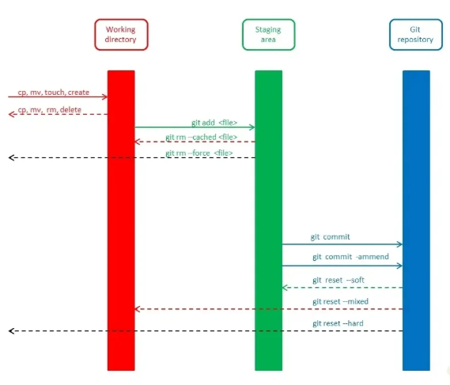

# Git

## Porque usar un sistema de control de versiones:
  + Da la posibilidad de guardar los cambios de un archivo de texto plano en el tiempo
  + Capacidad de volver a cambios realizados anteriormente
  + Git (Manejador de verisones mas famoso, utiliza el kernel de linux)
  + Solamente permite cambios en archivos de texto plano (No PDF o Docx o archivos binarios)

##   Tipos de Control de versiones:
  + *Locales*:
    * Cambios guardados en bases de datos locales (Computadores de los desarrolladores)

  + ***Centralizados***:
    * No dependen del dispositivo de computo sino que estan en un servidor
    * Generacion de conflictos y multiples trabajos simultaneos

  + ***Distribuidos***:
    * Cada dispositivo de computo interviene como repositorio
    * Si hay alguna falla, otro componente lo reemplaza

## Git:
  + Es un sistema de control de versiones (Software) pensado en la eficiencia y la confiabilidad del mantenimiento de un proyecto
  + Funciona como una linea de tiempo, nos permite volver en el tiempo
  + Sus propositos basicos son:
    * Llevar registro de cambios
    * Coordinar trabajo entre varias personas
  + Deja claro los siguientes aspectos:
    * Donde ocurrieron los cambios
    * Cuando ocurrieron los cambios
    * Quien realizo los cambios
  + Se realizan tanto en un repositorio local como remoto
  + El sistema de Git trabaja de manera local
  + Su sistema cuenta con 3 estados:
    * *Staged*
    * *Modified*
    * *Commited*

### Conceptos importantes de Git:
  + `Bug`: Se refiere a un error
  + `Repositorio`: Lugar dodne de almacena la informacion (Local, Remoto)
  + `Fork`: Tomar el proyecto de alguien con alguna finalidad
  + `Clone`: El fork es la copia en github y el clone permite trabajar en el proyecto de manera local
  + `Branch`: Es una bifurcacion en el proyecto para agregar o corregir funciones
  + `Master`: Rama de produccion, es la rama principal y no se trabaja en ella
  + `Push`: Accion por la cual se envia todo el material guardado en local a remoto
  + `Checkout`: Uso de Ramas
  + `fetch`: Traer cambios de remoto a local sin actualizar el repositorio local
  + `Merge`: Continuacion de fetch, es unir copia de remoto con local
  + `Pull`: combinacion fetch y merge
  + `Diff`: Muestra cambios entre versiones de codigo

### Estados Git

#### Estados de los archivos en git:

  + ***Archivo untracked***: Archivos que no existen en git
  + ***Unstaged***: Archivos que existen en git pero con cambios desactualizados
  + ***Staged***: Archivos en la zona de Staging (Memoria RAM)
  + ***Tracked***: Archivos en el repositorio git ya actualizados

### Ramas

#### Que es una Branch? y Como funciona un Merge?

  + Las ramas son aquellas que mantiene un orden y manipulacion seguraen el ambiente de trabajo.
  + Merge es la union de diferentes ramas

##### Clases de ramas:

  + ***Rama Master***: es la de produccion, es decir, es la rama principal de todo el ambiente de trabajo
  + ***Rama Development***: es la rama de desarrollo, donde se crean, eliminan o actualizan nuevas funcionalidades
  + ***Rama Hotfix***: es la ramna de arreglo de errores urgentes, esta se utiliza cuando hay un fallo grave que afecta produccion con el fin de no dañar nada mas en la master

## Comandos Git

### Incio de repositorio
- **git init** (Inicia un repositorio local)

### Clonacion y repositorios remotos
- **git clone "url"** (Clonar un repositorio al working area)

### Agregado y subida de archivos en repositorio local
- **git add "archivo"** (Agrega todos los cambios en todos los archivos al área de staging)
- **git add .** (Añade todos los cambios)
- **git commit -m "mensaje"** (Agrega finalmente el cambio realizado al repositorio local y le agrega un mensaje)
- **git commit -am "mensaje"** (Combinacion entre commit y add)
- **git commit --amend** (añade cambios a un commit anterior)

### Manejo entre repositorios remotos y locales
- **git push** (Enviar commits a un servidor remoto)
- **git fetch** (Traer cambios al repositorio local desde remoto)
- **git merge** (Unir cambios de remoto con local o unir ramas, para esto se debe estar en la rama a la cual se le quiere fusionar la otra)
- **git pull** (Combinacion entre fetch y merge)
- **git pull origin "rama"** (Traer los cambios o archivos que se encuentran en remoto pero no en local)
- **git pull origin "rama" --allow-unrelated-histories** (Traer los cambios o archivos que se encuentran en remoto pero no en local junto con su historial de commits)
- **git push origin "rama_local"** (Empujar una rama de local a remoto)
- **git pull origin "rama_remota"** (Traer una rama de remota a local)

### Status y informacion del repositorio
- **git status** (Muestra el estado en el que se encuentra el proyecto y el repositorio)
- **git show** (Muestra el historico de cambios hechos al repositorio y los detalles de estos cambios)
- **git log** (Muestra el historico de cambios del repositorio)
- **git log --stat** (Historial de commits con cambios)
- **git log --all --branch** (Muestra grafico con los commits y las brances de la historia del proyecto)
- **git log --all --branch --decorate --oneline** (Muestra grafico con los commits y las brances de la historia del proyecto comprimido)

### Eliminacion y reset de archivos del repositorio
- **git rm** (Eliminar archivos de git sin eliminar el historial)
- **git rm --force** (Borra todo, hasta del disco duro)
- **git rm --cache** (Borra los cambios de staged que se encuentran en RAM)
- **git reset "commitA" --hard** (Devuelve todo el ambiente de trabajo al commitA eliminando todo lo posterior y lo de staging)
- **git reset "commitA" --soft** (Devuelve todo el ambiente de trabajo al commitA eliminando todo pero dejando lo de staging)
- **git reset --mixed** (Devuelve todo el ambiente de trabajo al working area)
- **git reset HEAD** (Devuelve cambios de staging al working area)

### Configuracion de Git
- **git config --list** (Muestra configuraciones de git en le sistema)

### Manejo de Ramas
- **git branch** (Deja ver todas las ramas del ambiente de trabajo)
- **git branch "nombre_rama"** (Crea una nueva rama al ambiente de trabajo)
- **git branch -d "rama"** (Eliminar Rama)
- **git branch -a** (Muestra las branches en local y remoto)
- **git branch -r** (Muestra las branches en remoto)
- **git switch "nombre_rama"** (Cambia el working area a la rama seleccionada)
- **git show-branch** (Muestra las ramas que existen y su historial)
- **git show-branch --all** (Muestra las ramas que existen y su historial con mas detalle)
- **git reflog** (Muestra las Heads en el tiempo)

### Diferencias entre Commits
- **git diff "commitA" "commitB"** (Muestra las diferencias entre dos commits)
- **git diff "commitA"** (Muestra las diferencias entre el estado actual y el commit)
- **git checkout "commitA"** (Cambia el working area al commitA)

### Manejo de repositorios remotos (Origin/Upstream)
- **git remote add origin "url-ssh repositorio"** (Establecer un origen remoto)
- **git remote -v** (Verificar la existencia del origen remoto)

### Versionamiento de codigo
- **git tag -a v0.1 -m "Nombre" "id_commit"** (Hacer un tag o version de mi codigo)
- **git tag** (Muestra lista de todos los tags)
- **git show-ref --tag** (Muestra a que commit se asocia el tag, es diferente al id_commit vinculado)
- **git push origin --tags** (Empujar a remoto los tags que se crearon)
- **git tag -d "nombre del tag"** (Eliminar tag de manera local)
- **git push origin :refs/tags/"nombre del tag"** (Eliminar en github despues de local)

### Manejo de Staging area
- **git stash** (Guarda los cambios temporalmente en memoria cuando no quieres hacer un commit aun)
- **git stash save “mensaje”** (Guarda un stach con mensaje)
- **git stash list** (Muestra la lista de cambios temporales)
- **git stash pop** (Trae de vuelta los cambios que teníamos guardados en el ultimo stash)
- **git stash apply stash@{n}** (Trae el stash que necesites con indicar su número dentro de las llaves)
- **git stash drop** (Borra el ultimo stash)
- **git stash clear** (Borra todos los stash)
- **git clean --dry-run** (Hace una simulacion de borrar los archivos unstaged)
- **git clean -f** (Borra los archivos de unstaged)
- **git clean -d** (Borra los archivos y directorios de staged)
- **git clean -x** (Borra los archivos, directorios y archivos ignorados)

### Busqueda en el proyecto
- **git grep "palabra a buscar"** (Busca la palabra en el proyecto)
- **git grep -n "palabra a buscar"** (Busca la palabra en el proyecto y en que linea esta)
- **git grep -c "palabra a buscar"** (Busca la palabra en el proyecto y cuantas veces la uso)

 

  
