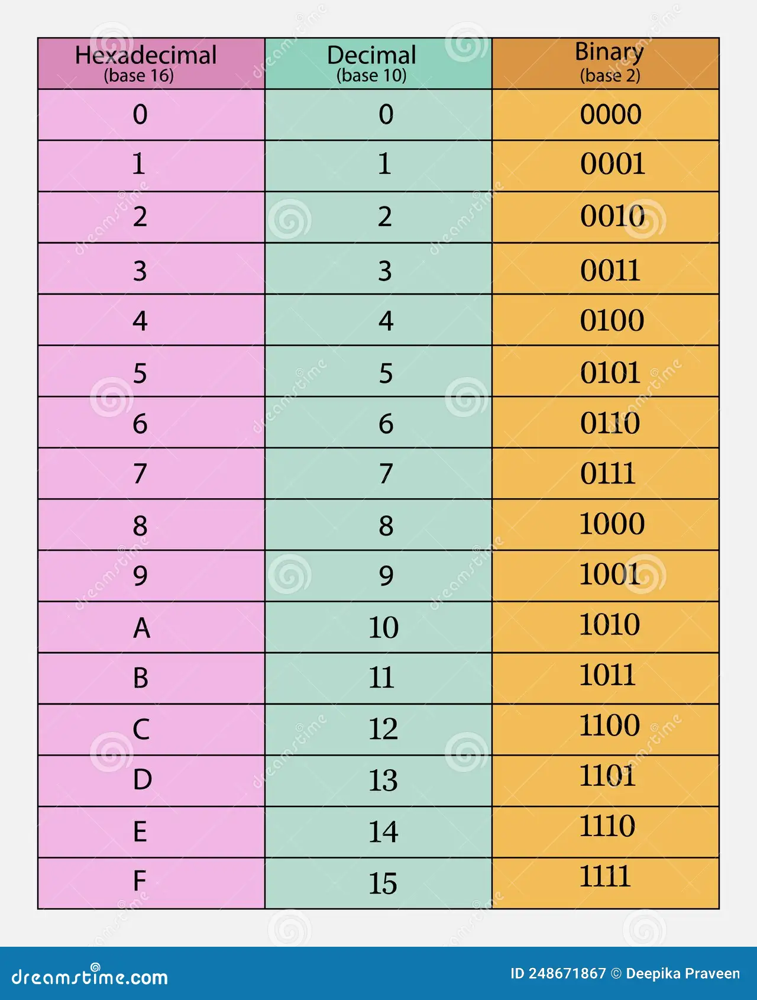
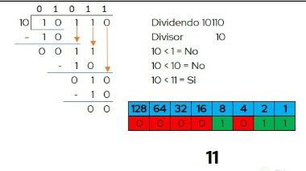
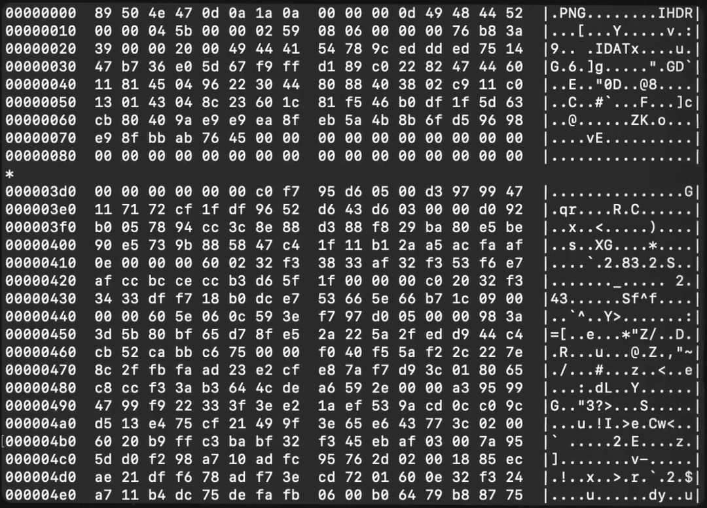

# Conceptos Básicos de Computación

Las computadoras nacen de que los seres humanos busquemos simplificar nuestro estilo de vida. 

Algunos componentes esenciales para entender cómo funciona un computador:

- Pixel $\longrightarrow$ Fragmento fisico minimo de una pantalla
- Hardware $\longrightarrow$ Componentes fisicos del computador
- Software $\longrightarrow$ Programas y sistemas logicos que controlan y usan el hardware
- Bit $\longrightarrow$ Unidad minima de informacion representada por (0 o 1)

## Bases numericas

- Hexadecimal $\longrightarrow$ numeros del 1 al 15 y es base 16
- Decimal $\longrightarrow$ Contando en base 10 (Cantidad de dedos)
- Binaria $\longrightarrow$ 0 o 1 y es en base 2.




> Fun fact: Un byte tiene 8 bits porque los primeros PCs tenian 8 cables.

### Operaciones Matematicas
  * *Propiedades*:
    - `Conmutativa`: Orden de los factores no afecta el resultado (Multiplicacion y Suma)
    - `Asosciativa`: 3 o mas factores se pueden de agrupas de distintas maneras y el resultado sera el mismo
    - `Distributiva`: La suma de dos factores, multiplicada por un tercer factor es igual a la suma de cada sumando multiplicado por 3
    - `Identidad`: La suma entre un factor y cero sera igual al factor y el producto entre un factor y uno sera igual al factor
+ Son aquellas que poseen:
  * Entradas
  * La Operacion (+;-:/;*)
  * Resultado

### Binarios 
$$
    2^n
$$
$$
    01010100 \longrightarrow 84
$$
- El primer bit $0$ es especial porque determina el signo del valor
- Con ellos se pueden representar:
    + Numeros
    + Texto 
    + Imagenes (Pixeles)
    + Videos (Imagenes por segundo)
    + Musica

#### De Binario a decimal
$$
    01010100 \longrightarrow 84
$$
$$
    2^2 + 2^4 + 2^6 = 84
$$

Se convierten en base dos aquellos bit los cuales posean el numero 1, en este caso, los mostrados anteriormente. 

#### De Decimal a Binario
 $$
95 \longrightarrow Binario
 $$

```pseudo
Entrada: n (entero no negativo)
Si n = 0 entonces
    devolver "0"
FinSi

binario ← cadena vacía
Mientras n ≠ 0 hacer
    bit ← n mod 2
    binario ← convertir_a_caracter(bit) + binario 
    n ← n div 2                                     
FinMientras

Devolver binario
```

Se divide entre 2 hasta que no se pueda llevar acabo la division $(n \neq 0)$ y siempre se antepone el ultimo bit calculado a los anteriores.

#### Operaciones

##### Suma

$$
0+0 = 0
$$

$$
1+0 = 1
$$

$$
0+1 = 1
$$

$$
1+1 = 0 
$$

Para este ultimo, con acarreo, es decir el valor real es 10

##### Resta

$$
0-0 = 0
$$
 
$$
1-0 = 1
$$

$$
1-1 = 0
$$

$$
0-1 = 1
$$

Para este ultimo, con acarreo, es decir el valor real es 11

##### Multiplicacion

$$
0*0=0
$$

$$
0*1=0
$$

$$
1*0=0
$$

$$
1*1=1
$$

##### Division




### Codificacion y representacion de caracteres

- ASCII $\longrightarrow$ Tabla que permite codificar caratcreres en forma numerica
- UTF $\longrightarrow$ Unicode Transformation Format, es como la version 2 de ASCII, contiene mas caracteres, emojis, alfabetos, etc.

## Seguridad Informatica
+ Hay distintos tipos de virus:
  * De gusano
  * Adware
  * Spyware
  * Ransomware
  * Troyanos
  * Botnet

## Formatos de Archivos

Los archivos se pueden ver de la siguente manera: 



Este archivo tiene la representacion en 3 formas:

1. Columna 1 $\Longrightarrow$ Codigo **ASCII**
2. Columna 2 $\Longrightarrow$ Expresion Hexadecimal
3. Columna 3 $\longrightarrow$ Documento (Cabecera posee el tipo de archivo que es)

> Esteganografia (Ocultar archivos en un archivo diferente)
