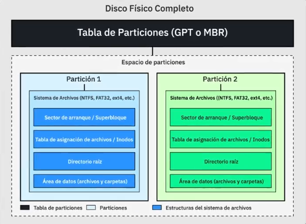
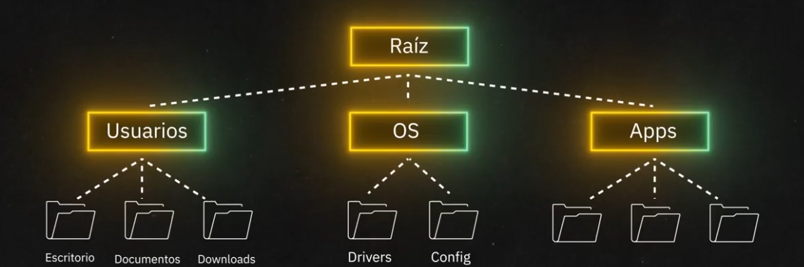
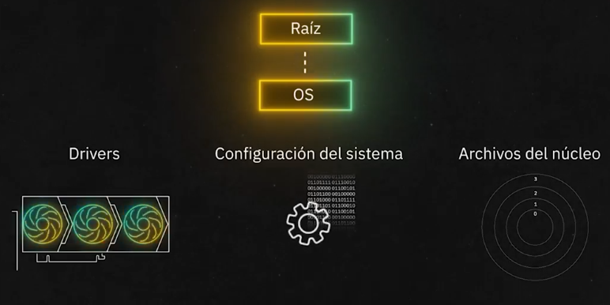
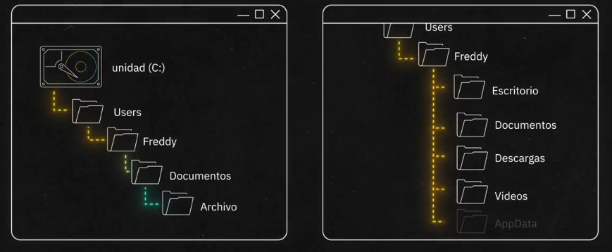

# Hardware
+ Esta dividio en varios componenetes
  * GPU (Graphic Processing Unit)
  * CPU (Central Processing Unit)
  * Almacenamiento (SSD, HDD, M.2)
  * Memoria RAM (Random Access Memory)
  * Tipo de Pantalla

## Componentes del Sistema

Elementos físicos que permiten el funcionamiento del computador:

- Memoria RAM $\longrightarrow$ Guarda datos y programas en uso mientras el computador recibe corriente
- Disco Duro $\longrightarrow$ Almacena datos de forma permanente y almacena el sistema operativo 
- CPU (Central Processing Unit) $\longrightarrow$ Ejecuta las instrucciones del sistema y programas de forma serial, ademas se encarga de administrar los recursos. 
- GPU (Graphic Processing Unit) $\longrightarrow$ Procesa graficos e imagenes, hoy en dia son usadas para el desarrollo de inteligencia artificial por su capacidad de procesamiento paralelo
- SoC (System on a Chip) $\longrightarrow$ integra todo lo anterior en un solo chip
- Puertos Externos $\longrightarrow$ Son los puertos usados para las conexiones con dispositivos externos, los mas comunes son:
  * Ethernet: Conexion a red
  * HDMI: Proyeccion de video
  * USB (Universal Serial Bus)
  * Jack: Emision de Audio

## Inicio y Arranque del Sistema

Procesos que ocurren desde que se enciende el computador hasta que carga el sistema operativo:

1. BIOS (Basic Input Output System) $\longrightarrow$ Firmware que inicia y configura el hardware, Hoy en dia reemplazado por la UEFI (Unified Extensible Firmware Interface)
2. POST (Power-On Self-Test) $\longrightarrow$ Es una verificacion inicial que revisa que todos los componentes funcionen correctamente
3. Boot Loader $\longrightarrow$ Programa que es ejecutado por la UEFI para cargar el OS
   * Secure ROM 
   * PBL (Primary Boot Loader) 
  
## CPU (Central Processing Unit)

- Se encarga de procesar datos y almacenar información temporalmente en la memoria RAM.

### ¿Cómo funciona una CPU?

- Ejecuta operaciones matematicas (Suma, resta, etc.)
- Mueve los datos de la memoria para procesarlos (Mueven, usan, borran, etc.)
- Procesa la informacion en ciclos electricos medidos en Hertz (Hz) $\longrightarrow$ ciclos por segundo que realiza un procesador
- La velocidad de los procesadores esta dada en MHz o GHz (Millones o miles de millones) de ciclos por segundo.

### Marcas y tipos de CPU

- Intel (Core i3, i5, i7, Xeon)
- AMD (Ryzen)
- Apple (M1, M2, M3, M4)
- Otros: Snapdragon, Huawei.

### Relación entre Velocidad, Electricidad y Calor

$$
  + Hz = + V = + A = + C
$$

- Mayor cantidad de ciclos es igual a mas velocidad del procesador que es igual a que el procesador recibe mas corriente y por ende, este genera mas calor. 
- El calor limita la velocidad de la CPU y por ende, es necesario usar sistemas de refrigeracion.

### Composicion de las CPU

- Hechos de silicio (14 protones), mas especificamente **wafer de silicio**
  
#### Creación de Chips

- Se utiliza una tecnología llamada láser litográfico extremo ultravioleta.
-  El fabricante más importante de esta tecnología es ASML (Holanda).
-  El láser graba estructuras de transistores en el wafer para formar la CPU.

#### Pruebas y Clasificación de CPUs

- Chips con fallas en los nucleos se venden como versiones más económicas (i3, i5).
- Chips con ninuga falla en los nucleos, por ende, se venden como versiones premium (i7).

### Cómo mejorar la velocidad de una CPU

- Reduciendo el tamaño de los transistores para meter mas transistores en el chip
- Aumentando la cantidad de núcleos (2, 4, 8...).
- Mejorando la dispersión térmica y el enfriamiento.

### Memoria y Jerarquía

- Las CPUs tienen dos componentes importantes:
  - Transistores  (Realizan las operaciones)
  - Registros (Almacenamiento de accesos rapido)

- Las velocidades de los almacenamientos estan dados por:
    1. Cache
    2. RAM
    3. Disco Duro

### Arquitecturas de CPUs

- x86: General, popular en PCs con Windows.
- RISC: Conjunto reducido de instrucciones, ideal para servidores.
- ARM: Optimizado para bajo consumo de energía, común en móviles.

### Técnicas modernas de procesamiento

- Ejecución especulativa: La CPU predice instrucciones para ganar velocidad. (Frontera actual de construccion de chips)

### Otros tipos de Chips Especializados

- TPU (Tensor Processing Unit): Procesamiento de inteligencia artificial.

## Memorias

Existen dos tipos de memorias en el computador:

- **Persistentes**: Los datos e informacion permanece en el computador incluso despues de que no haya corriente
- **Volatiles o no persistentes**: Los datos e informacion existe mientras que el computador reciba corriente

Los exponentes de ambos tipos de memoria son:

- Drives: Guardan la informacion
- RAM & Cache: La informacion esta en uso

### No persistentes

Estas memorias fueron creadas para que cuando la CPU este procesando los datos, le sea mas facil acceder a dichos datos en vez de accederlos desde los Discos persistentes. 

- La RAM es 7000 veces mas rapida que un SSD y el SSD es 70 veces mas rapida que los HDD.

- Cuando una informacion que estaba siendo procesada, deja de serlo y ademas se queda almacenada en la RAM, los OS ejecutan un proceso llamado el **garbage collector** que retira la informacion que ya no esta siendo usada de la RAM para que no llene su capacidad.

> Memristor (Intel Optain) son capaces de procesar y almacenar datos de manera simultanea. 

### Persistentes

Los drives son unidades las cuales guardan de manera permanente los datos que fueron procesados por la CPU, existen dos tipos principales:

1. Hard Drives: Poseen platos los cuales giran en un lector para guardar y leer la informacion
2. Solid State Drives: Son celdas de memoria que necesitan un flujo de corriente para funcionar (Por ello son mas rapidos)

Las formas en que los drives guardan la informacion depende del OS y los formatos de memoria, hay 4 principales formatos:

1. FAT 32: Formato original de Windows, ademas los archivos solo podian pesar maximo 4GB y estos no tenian ningun tipo de seguridad. Actualmente usado por pendrives. 
2. NTFS: Formato actual de Windows, es mas veloz y si contiene seguridad para acceder a los archivos
3. APFS: Usado por Apple
4. Ext 3/4: Altos niveles de seguridad y sistema de permisos y es mas comun en los sistemas linux

#### Cabeceras de mapas de archivos

Son indices los cuales permiten al OS, interpretar donde empieza y donde termina un archivo. 

Cuando se eliminan archivos, realmente lo que se hace es que la cabecera elimina el apuntador que tiene al bloque, dejando "huerfanos" a los datos, sin embargo, estos no se eliminan del disco. Lo que hace el OS, es que cuando se necesite guardar nueva informacion, usa los bloques *vacios* o *huerfanos* que aun poseen informacion y los reescribe con la nueva informacion a guardar. 

Lo anterior ocaciona que los bloques de los archivos no esten ordenados y al ser una cabeza de lectura (Tocadiscos Vinilo), hace que el disco sea mas lento. Sin embargo, hay un proceso que se llama **Desfragmentacion** el cual es ordenar los bloques para que los archivos y sus datos esten juntos pegados unos a otros acelerando los procesos del disco. 

> Este proceso desgasta el disco mas de lo normal, ya que tiene que escibir y leer mas veces.

#### Como se organizan los archivos

- En windows, la Raiz del sistema de archivos la cual es comunmente conocida como **C:**, es el nombre que que le da windows al disco duro

- En sistemas Unix, la Raiz del sistema se denota con un **/** el cual indica donde incia el sistema operativo. 

- En Unix, los discos se denotan en **/mnt/disco**

##### Jerarquia

##### OS

En los ficheros del sistema oerativo se almacena:

- Los drivers
- Las configuraciones del OS
- El kernel

##### Usuarios

En los ficheros de los usuarios hay todo tipo desde almacenamiento, como por ejemplo:

- Documentos
- Descargas
- Configuraciones de aplicaciones y OS

## SoC (System on a Chip)

Un SoC agrupa múltiples componentes en una sola pieza:

  - CPU (procesador central)
  - GPU (procesador gráfico)
  - Memoria RAM
  - Módem para llamadas y datos
  - Otros sensores (cámara, micrófono, parlante, etc.)

Esto se logra colocando distintos tipos de transistores muy cerca unos de otros dentro del mismo chip de silicio.

### Ventajas del SoC

  - Menor consumo de batería.
  - Menor generación de calor.
  - Más eficiencia en el procesamiento.
  - Mejores tiempos de respuesta en dispositivos móviles.
  - Estandarización del hardware, facilitando el diseño y producción.

### El arranque del sistema en un SoC

  1. Al presionar el botón de encendido, se activa un circuito.
  2. Ese circuito inicia la BIOS o iBoot en dispositivos Apple.
  3. Se activa la CPU, que busca el sistema operativo en la memoria flash.
  4. CPU y GPU comienzan a trabajar en conjunto.

### Sensores y seguridad en los teléfonos

  - Los teléfonos modernos tienen sensores como barómetros, termómetros y estabilizadores ópticos.
  - La cercanía entre la batería y los componentes requiere un control térmico estricto para evitar riesgos como explosiones.

### Arquitectura ARM y dominancia de los SoC

  - ARM es la arquitectura más común en los SoC, especialmente en teléfonos, relojes inteligentes y autos.
  - Los chips ARM son eficientes, pequeños y potentes.
  - Fabricantes como Huawei innovaron integrando módems 5G directamente en sus SoC (Kirin 990).

### SoC y la inteligencia artificial

  - Los nuevos chips incluyen NPU (Neural Processing Units) para procesar tareas de inteligencia artificial.
  - Estas tareas incluyen: reconocimiento de voz, filtros en redes sociales, asistentes digitales, etc.
  - Apple y otros fabricantes usan memoria unificada para que CPU, GPU y NPU trabajen juntas eficientemente.

### El futuro de los SoC

  - Algunos SoC ya tienen hasta 16 núcleos, más que muchas PCs actuales.
  - Con la IA creciendo, la necesidad de procesamiento local y eficiente impulsa el desarrollo de SoC cada vez más potentes.
  - Apple lidera en inteligencia artificial local gracias a su arquitectura de SoC.

## GPU (Graphic Proccesing Unit)

### Diferencias entre CPU y GPU

  - CPU: Procesa información de manera serial (paso a paso), ideal para tareas complejas como abrir una hoja de cálculo o navegar en internet.
  - GPU: Tiene muchos núcleos pequeños que procesan en paralelo, es decir, realizan muchas tareas simples al mismo tiempo. Esto es ideal para mostrar imágenes donde millones de píxeles deben calcularse simultáneamente.

### El papel de la GPU en los gráficos

Las imágenes en pantalla se forman con píxeles. Cada uno necesita calcular su color y brillo (rojo, verde, azul). Esto debe hacerse al mismo tiempo: tarea perfecta para una GPU. Por eso, las GPUs tienen su propia memoria: VRAM (memoria de video), que guarda texturas, polígonos y efectos para los videojuegos.

#### El impacto de los videojuegos en la industria de chips

Empresas como NVIDIA y ATI (ahora AMD) impulsaron la creación de tarjetas gráficas. Las consolas de videojuegos (como PlayStation o Xbox) son básicamente computadoras diseñadas solo para jugar, optimizadas con GPU.

#### Computación científica con consolas

En su momento, científicos aprovecharon el chip del PlayStation 3 (hecho por IBM) para crear supercomputadoras baratas instalando Linux en las consolas. Como no compraban juegos, Sony dejó de permitirlo.

#### GPUs y la inteligencia artificial

La IA también necesita procesamiento paralelo, ideal para GPUs. Los primeros modelos de lenguaje, como ChatGPT, se entrenaron en GPUs. Además, los autos autónomos como los Tesla usan GPUs para procesar imágenes de cámaras y tomar decisiones en tiempo real.

### Programar para GPU

Así como la CPU usa lenguajes como C++ o Python, las GPUs pueden programarse con lenguajes como CUDA, creado por NVIDIA. Esto permite aprovechar su potencia para tareas más allá de los videojuegos.

### Estructura física y refrigeración

En computadoras normales, la GPU se conecta a través del puerto PCIe. En celulares o computadoras modernas, CPU y GPU están unidas en un mismo chip: el SoC (System on a Chip). Las GPUs requieren ventilación propia, e incluso a veces se enfrían con aceite.

### Más usos de la GPU

  - Video y códecs: Algoritmos como los usados por YouTube o Netflix ahora se ejecutan en partes especializadas de la GPU para ahorrar energía.
  - Ray tracing: Simula la luz real en videojuegos. Hoy se hace directamente con unidades dedicadas en la GPU.
  - Minería de criptomonedas: Bitcoin y otras monedas usan cálculos paralelos que las GPUs ejecutan muy bien. Esto llevó a la creación de “granjas” de minería.
  - Realidad virtual y aumentada: Necesitan procesar imágenes para cada ojo, aumentando la demanda de GPUs.

