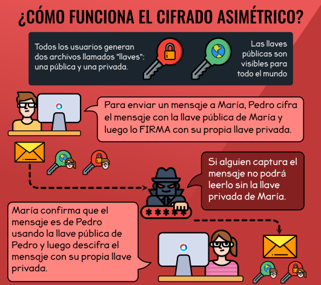
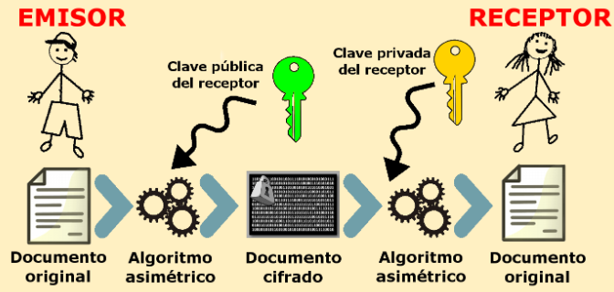
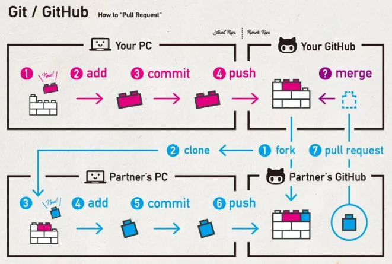

# Github

  + Es un complemento a Git, es un servicio de alojamiento
  + Alojamiento de proyectos de manera publica y gratuita
  + Colaboracion con otros proyectos y los propios
  + Ayuda a detectar fallos mas rapido y eficientemente
  + Son en pocas palabras, **Repositorios Remotos**

## Conexion entre local y remoto

### Sistema de Cifrado de llaves publicas y privadas:
  + Cifrar mensajes en transito
  + Es un algoritmo el cual es tambien llamado cifrado asimetrico de un solo camino (matematico)
  + Llave privada esta vinculada con la llave publica
  + Nadie debe conocer la llave privada
  + Cifrar mensaje con la llave publica
  + Sin la llave privada no se puede decifrar el mensaje
  + Una llave es pública y se puede entregar a cualquier persona, la otra llave es privada y el propietario debe guardarla de modo que nadie tenga acceso a ella.

#### Configuracion de llave publica-privada con Github:

  + **Pasos Generacion local:**
    1. ssh-keygen -t "algoritmo" -b "Nivel de complejidad" -C "Correo vinculado a Github"
    2. Directorio de guardado (Darle enter)
    3. passphrase (Contraseña para la llave publica)
    4. Ir al directorio para verficar la creacion exitosa de llaves (Publica y privada)
    5. eval $(ssh-agent -s) (Es para ver si el proceso esta corriendo)
    6. ssh-add ~/.ssh/id_"algoritmo"

  + **Pasos conexion github:**
    1. cat ~/.ssh/id_"algoritmo".pub
    2. Copiar llave publica
    3. En github:
        1. En settings
        2. SSH and GPG keys crear una nueva llave
        3. En el apartado de key, pegar la llave publica

## Colaboracion de proyectos

  + En settings del repositorio ir a collaborators y añadir a la persona por email o user de github

### Hacer Fork:
  + Opcion de Github
  + Copiar el repositorio en nuestro perfil
  + Para actualizar, Hacer git remote add del repositorio original(upstream), git pull upstream, git push origin

### Trabajo con pull request

  + Es como normalmente se trabaja, la rama master se bloquea
  + Pull request es un estado intermedio entre el envio y el merge
  + Es una caracteristica de github
  + Los revisa y confirma el DevOps
  + Hay dos ramas con diferencia, ir a github y ver las opciones de pull request
  + Opcion crear un pull request - añadir personas asignadas
  + Hacer el feedback del pull request (Revisar las opciones, son interesantes)
  + Aprobar los cambios
  + Hacer merge

## Archivos .gitignore

  + Es una lista de archivos en la cual se deben omitir es decir que no se suben en el repositorio de github

## Github Pages

  + Hostear paginas estaticas
  + nombre_repositorio = nombre_repositorio.github.io
  + Settings en el repositorio en pages, Tomar el master Branch