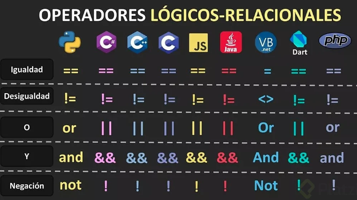

# Software
+ Son los programas que utiliza la computadora los cuales estan compuesto por series de instrucciones que se le van a dar a la computadora:
  * Chrome
  * VsCode
  * Juegos de video

## Flujo de un software
1. Input
2. Almacenamiento (Memoria)
3. Procesamiento (CPU o GPU)
4. Output
5. Almacenamiento persistente


## Algoritmo

- Es un conjunto de pasos definidos de manera no ambigua para resolver un problema o lograr un objetivo
  
- Se basan en el principio de **Divide y Conquista**

- Es una expresion matematica de las instrucciones que se les pueden dar a un sistema

```pseudo
Mientras (temperatura != usuario)
  Si (temperatura < usuario)
    calentar()
  sino
    enfriar()
  ventilar()
```

## Lenguajes Programacion

Convierten los algoritmos en los lenguajes de maquina. Estos corren en la CPU de dos maneras: 

1. Compilacion $\longrightarrow$ convertir el lenguaje usado por los humanos en lenguaje de maquina (Binario)
2. Interpretados $\longrightarrow$ son lenguajes que se van interpretando o leyendo linea a linea, transforman el codigo en codigo ejecutable en el chip sin compilacion. 

> (JIT - Just In Time Compiling) El codigo se compila antes de ejecutar

### Tipos de dato
- `Char`: Es un caracter de texto
- `String`: Es un texto
- `Numerico`: int, Long, double, float
- `Boolean`: True o False
- `Arrays`: Listas de datos multiples (Estructura de datos)

### Operadores

#### Logicos
- `No` (Invierte el valor de la afirmacion)
- `Y` (Devuelve True cuando ambas afirmaciones son verdaderas)
- `O` (Devuelve Truecuando una afirmacion es verdadera)
- `XOR` (Solo 1 proposicion debe ser verdadera mas no ambas)
#### Artimeticos
- `+` (Suma de valores)
- `-` (Resta de valores)
- `*` (Multiplicacion de valores)
- `^` (Potenciacion)
- `/` (Division)
- `//` (Division entera)
- `%` (Residuo de division o modulo)
#### Comparacion
- `<` (Menor que)
- `>` (Mayor que)
- `<=` (Menor o igual que)
- `>=` (Mayor o igual que)
- `=` (Igual que)
- `<>` (Diferente de)



### Estructuras de control
- `Condicionales`: Tomar desiciones con base a comparaciones u operaciones
- `Ciclos`: Realizar iteraciones con base a una condicion o situacion
#### Tipos de Condicionales
- `If/Else-If/Else`: Se usan en respuestas de True y False (1,0)
- `Switch`: Evalua diferentes casos sobre una comparacion o una situacion especifica
- `Try-Catch`: Se usa en el manejo de errores y permite tener un plan B en caso de algun fallo
#### Tipos de Ciclos
- `For`: Recorrido de diferentes iteraciones de acuerdo a una cantidad de iteraciones necesarias y una condicion
- `While`: Mientras una situacion se cumpla se ejecutan las instrucciones
- `Do-While`: Primero ejecuta las instrucciones y despues revisa si la condicion se cumple y vuelve a ejecutar

### Funciones
- Son bloques de instrucciones quue hacen una actividad en concreto
- Partes de una funcion:
  + Parametros (Entradas)
  + Instrucciones
  + Retorno o resultado
- Alcance:
  + `Privadas`:
    * Funcionan en forma local
    * Otros algoritmos no pueden acceder a estas
  + `Publicas`:
    * Alcance global
    * Otros algoritmos pueden usarlas


