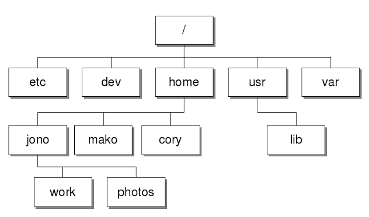

# Linux

## Configuracion de ambiente de desarrollo

- **Que es linux y porque instalarlo:**
  + Es la familia de sistemas operativos (SO) que usan el kernel de linux
  + Distribuciones (Ubuntu, Arch linux, debian, etc.)
- **Instalarlo en Dual-Boot:**
  + Necesaria un USB (16GB), Imagen ISO (Distribucion linux), Banela-Etcher
  + Con Banela crear el USB booteable con la Imagen ISO
  + Desfragmentar discos de arranque de la maquina (2 secciones, 1 Windows y otra Linux)
  + Acceder a la BIOS de sistema para:
    * Busacr option the boot
    * opcion de arranque - Cambiarla para usar el USB Booteable
    * Desactivar secure Boot
    * Guardar y salir
  + Seleccionar ubuntu en el GRUB (Interfaz capaz de mostar los SO que se encuentran en la maquina)
  + Instalar Ubuntu
  + En tipos de instalacion elegir mas opciones y seguir el siguente proceso:
    * Hacer particiones a partir de la principal de linux
    * Espacio Root - SO principal (Minimo 20GB)
    * swap/Area intercambio - Mitad del espacio de la memoria RAM, es deicr 8GB si son 16GB en RAM (1GB - 1024MB)
    * Home - Unidad C: de Linux, es donde se intsala y se descarga todo.
    * Reiniciar y retirar USB booteable
- **Instalacion de programas:**
  + Descargar archivos .deb
- **Instalar IDE:**
  + Instalar desde la ubuntu software store
- **Instalacion de Nodejs:**
  + curl -o- https://raw.githubusercontent.com/nvm-sh/nvm/v0.39.7/install.sh | bash
  + nvm install --lts (MVN Node Version Manager)
  + node -v

> Para la instalacion de Python y Git junto la creacion de un proyecto Reactjs revisar las configuraciones de windows y MacOS ya que es lo mismo.

## Sistemas de archivos

## Jerarquia de directorios

## Libros

- Linux Basics for Hackers
- Linux Command Line