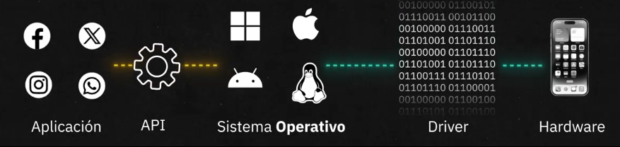

# OS (Operating System)

Es un intermediario entre el hardware y el software el cual coordina de manera efectiva y estandarizada las instrucciones de los software hacia el hardware y viceversa. 

## Software de Bajo Nivel

Programas que conectan el hardware con el sistema operativo y gestionan tareas fundamentales:

- kernel $\longrightarrow$ Es el nucleo del sistema operativo y es aquel que funciona como intermediario entre el software y hadware
- Drivers $\longrightarrow$ Programas los cuales se comunican con el hardware
- Assembler $\longrightarrow$ Lenguaje de programacion de bajo nivel, este se usa para programar instrucciones las cuales los computadores puedan entender.

## Comunicacion Hardware-Software

El **OS** se comuncia por dos medios, uno para con el software y otro para con el hardware:

- APIs $\longrightarrow$ Comunicacion entre OS y Apps
- Drivers $\longrightarrow$ Comunicacion entre OS y Hardware

 

## Gestion de recursos

- Memoria
    * Operaciones Rapidas (RAM)
    * RAM al tope, se pasa al SWAP area (porcion del disco duro) $\longrightarrow$ Va intercambiando los datos con la RAM
    * Garbage Collector $\longrightarrow$ Libera el espacio de la memoria
- Procesos
    * El OS organiza y prioriza las tareas
    * El OS detiene procesos para atender otros de mayor prioridad o bien aquellos que llevan mucho tiempo sin acceder a memoria\
    * Hay Jerarquia y estados en los procesos y aquellos considerados de alto nivel pueden interrumpir a otros
- Almacenamiento
    * Cada sistema operativo tiene una forma de acceder y guardar en el disco duro los archivos
        + Apple (MacOS) $\longrightarrow$ **APFS** esta optimizado para SSD, cifrado nativo y snapshots
        + Windos $\longrightarrow$ **NTFS** usado para Journaling, comprension y cifrado Bitlocker
        + Linux $\longrightarrow$ **Ext 3/4** esta optimizado para Alta escalabilidad, Journaling y extents

## Seguridad

El OS utiliza diversas formas de garantizar seguridad

- Permisos de Usuarios $\longrightarrow$ Quien puede leer, escribir y correr archivos
- Cifrado $\longrightarrow$ Proteccion de acceso a la informacion
- Gestor de llaves $\longrightarrow$ Guarda las llaves publicas y privadas 
- Firmas digitales y certificados digitales $\longrightarrow$ Garantizan que una aplicacion es segura
- Anillos de seguridad del OS:
    1. Anillo 0 (**Kernel**): Es el de los privilegios mas altos y es donde se ejecuta el Kernel del OS, por ende, es aquel que tiene mas acceso al hardware y los recursos del sistema
    2. Anillos 1 y 2 (**Drivers**): Es donde cargan los drivers
    3. Anillo 3 (**Aplicaciones**): Es donde cargan todas las aplicaciones

## Interfaces y máquinas virtuales

Existen 2 formas de interactuar con el OS

- GUI (Interfaz grafica)
- CLI (Linea de comando)

Por otro lado, dentro del anillo 1, se pueden instalar maquinas virtuales (Computadoras embebidas en espacios virtuales dentro de un servidor)

## Windows & Linux & MacOS

El incio de los sistemas operativos se remonta a **Unix**, este tenia kernel, sistema de control de usarios, etc. De *Unix* surge uno de los sistemas operativos academicos mas usados **BSD** de la universidad de Berkley, y mucho despues de este mismo, nace **MacOS**. 

Esta solo fue una rama de *Unix*, la otra es **Linux**, creado por Linus Torvalds basandose en el principio del OpenSource de (GNU), de este se deriban muchos sistemas, ya que al ser el mas popular y de codigo abierto, fue posible manejarlo a gusto del desarrollador.