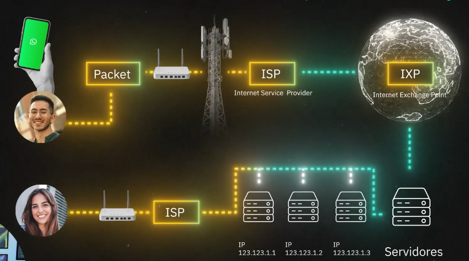
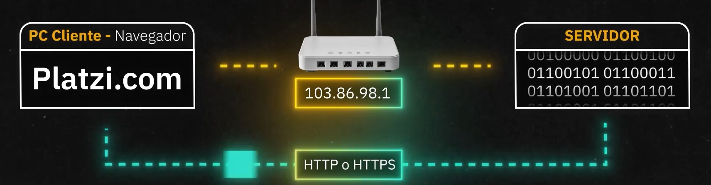

# Internet

- Los dispositivos se conectan a internet por medio de: 
    + Wifi
    + Antena (4G, 3G, 2G)
    + Ethernet (Cables UTP)

## Proceso de envio de mensajes de internet

## Direcciones IP y Internet protocol

- Todas las computadoras tienen direcciones IP.
- Las IPs locales son diferentes a las IPs de internet

### Anatomia direccion IPv4

$$
255.255.255.255
$$

- 4 octetos
- Cada octeto de 8 bits
- 256 es el total de numeros en 8 bits
- Direcciones de 0 a 255
- 32 bits en una sola direccion
- 4 300 000 000 posibles numeros dados por 32 bits

### Anatomia direcciones IPv6 

$$
2001:0db8:0000:0042:0000:8a2e:0370:7334
$$

- IPv6 tiene 128 bits en su anatomia de direccion
- Las direcciones estan construidas por 8 cuartetos de numeros **hexadecimales**
- La base **hexadecimal** posee 16 numeros: del 0 a la F (representa 15)
- Cuando algun componente del IPv6 esta lleno de ceros, se representan con $::$ comprimiendola

### NAT (Network Address Translation)

Es una tecnologia de los routers que transforma las peticiones de una red local a una red externa (Internet)

### Autoridades Reguladoras

#### IANA (Internet Assigned Numbers Authority)

Esta es la autoridad la cual asigna las IP permanentes de las computadoras

## DNS (Domain Name System)

Es una base de datos distribuida la cual posee los nombres de las direcciones IP. 

### TLD (Top Level Domain)

Son sufijos que se le agregan a los dominios para diferenciarlos. Existen algunos los cuales son completamente reservados para ciertos sectores o paises:

1. .gov: Gobiernos
2. .gob: Gobiernos en Latinoamerica
3. .edu: Instituciones educativas acreditadas
4. .mil: Ejercito y militar
5. .co: Colombia
6. .br: Brasil
7. .jp: Japon

> namecheap.com para comprar dominios

## Modelo Cliente-Servidor

